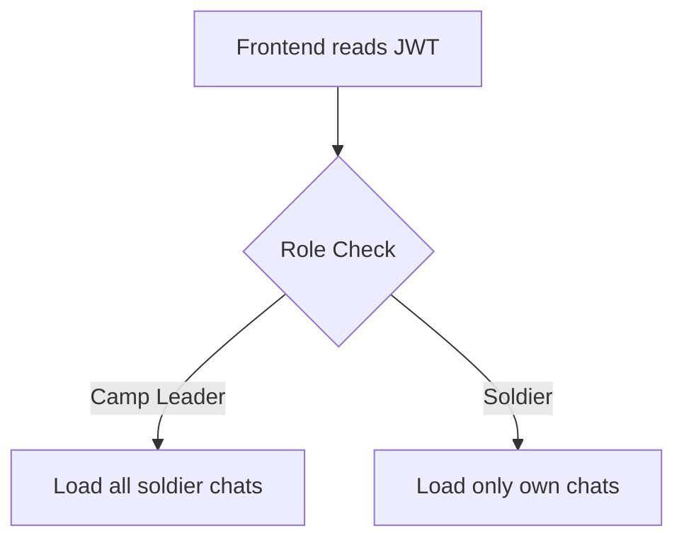

# Camp Leader Chat Platform Flow  
**Stack:** MERN (MongoDB, Express, React, Node.js) + JWT Auth + AES Encryption

---

## 1. User Roles & Permissions

| Role           | Permissions                                                                                   |
|----------------|----------------------------------------------------------------------------------------------|
| **Camp Leader**| - View all soldiers’ chats<br>- Send messages to any soldier<br>- Create new chat threads    |
| **Soldier**    | - View only their own chat history<br>- Send messages to camp leader or assigned threads     |

---

## 2. Authentication & Authorization (JWT)

**Login Flow:**
1. User submits **username/email + password**.
2. Backend validates credentials.
3. Backend issues a **JWT** with payload:
   ```json
   {
     "userId": "123456",
     "role": "soldier" // or "camp-leader"
   }
   ```
4. Frontend stores JWT (e.g., `localStorage` or React Context).

**Request Flow:**
- All API requests include JWT in the header:
  ```
  Authorization: Bearer <JWT_TOKEN>
  ```
- Backend middleware verifies JWT and extracts `userId` & `role`.
- Access is filtered based on role:
  - **Camp Leader:** Access to all chats.
  - **Soldier:** Access only to their own chats.

---

## 3. Role-Based Dashboard Logic



---

## 4. Secure Chat Flow (Encryption)

1. **Message Creation:**  
   - Soldier UI encrypts message (AES-256 recommended).
2. **Transmission:**  
   - Message sent via Socket.IO or Axios (HTTPS/WSS).
3. **Storage:**  
   - Backend stores encrypted message in MongoDB.
4. **Retrieval:**  
   - Backend decrypts message only for authorized users.
5. **Display:**  
   - Frontend displays decrypted message.

**Security:**  
- **Encryption at rest:** All messages encrypted in DB.  
- **Decryption:** Only on authorized retrieval.  
- **Encryption in transit:** Use HTTPS/WSS.

---

## 5. Backend API Overview

| Endpoint                   | Method | Access         | Description                                 |
|----------------------------|--------|---------------|---------------------------------------------|
| `/api/auth/login`          | POST   | Public        | Login, returns JWT                          |
| `/api/auth/register`       | POST   | Admin         | Register camp leader or soldier             |
| `/api/chats`               | GET    | JWT Protected | Get chats (filtered by role)                |
| `/api/chats`               | POST   | Leader only   | Create new chat thread                      |
| `/api/messages/:chatId`    | GET    | JWT Protected | Get messages for a chat                     |
| `/api/messages`            | POST   | JWT Protected | Send (encrypted) message                    |

**API Flow:**
- JWT required for all protected endpoints.
- Middleware decodes JWT and enforces role-based access.
- Messages are encrypted/decrypted as needed.

---

## 6. Realtime Chat (Socket.IO Rooms)

- **Camp Leader:** Joins all chat rooms.
- **Soldier:** Joins only their own room.
- **Message Flow:**  
  - Emit/receive messages in respective rooms.
  - Backend verifies JWT, encrypts/decrypts messages.

---

## 7. Security Best Practices

- **JWT Authorization:** Enforce on every API and socket event.
- **Password Hashing:** Use `bcryptjs`.
- **Token Expiry:** Implement refresh tokens if needed.
- **Role Filtering:** Soldiers cannot access other soldiers’ chats.
- **AES-256 Encryption:** For all messages at rest.
- **HTTPS/WSS:** Encrypt all traffic in transit.
- **Optional:** Per-chat keys or end-to-end encryption for higher security.

---

## 8. Summary

- **JWT**: Contains `userId` and `role` for secure authentication/authorization.
- **Backend**: Validates JWT on every request.
- **Encryption**: Messages are encrypted at rest and in transit.
- **Camp Leader**: Full chat visibility.
- **Soldier**: Access limited to own chats.
- **Realtime**: All updates via Socket.IO rooms.
